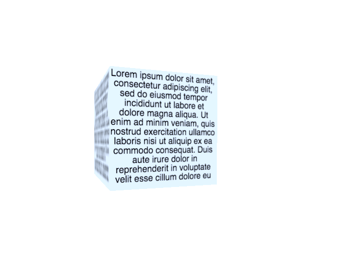

# AFrame Text Wrap Component

Wrappable text as a material for an [A-Frame](https://aframe.io) VR entity. Requires [`draw`](https://github.com/maxkrieger/aframe-draw-component).



All attributes are listed below.

## Installation
```
npm i aframe-draw-component --save
npm i aframe-textwrap-component --save
```
##Usage

Register the component with AFrame:

```js
var AFRAME = require("aframe-core");
var draw = require("aframe-draw-component").component;
var textwrap = require("aframe-textwrap-component").component;
AFRAME.registerComponent("draw", draw);
AFRAME.registerComponent("textwrap", textwrap);
```

Then integrate it on an entity:

```html
<a-entity id="box" geometry="primitive: box" position="0 2 0" draw="background: #D7E8FF" textwrap="textAlign: center; x: 128; y: 128; text: Hello world!"></a-entity>
```


##Properties

All properties have a default! :)

|Property|Description|
|------|-------|
|`text`|the text that should be wrapped. **If your text contains a colon (`:`) or a semicolon (`;`), you can escape it using `url(my:text;)`.**|
|`x`|canvas x position of the text (upper left corner)|
|`y`|canvas y position of the text (upper left corner)|
|`font`|css `font` string ([see here](https://developer.mozilla.org/en-US/docs/Web/API/CanvasRenderingContext2D/font))|
|`color`|color of the text|
|`textAlign`|text alignment ([see here](https://developer.mozilla.org/en-US/docs/Web/API/CanvasRenderingContext2D/textAlign))|
|`textBaseline`|text baseline ([see here](https://developer.mozilla.org/en-US/docs/Web/API/CanvasRenderingContext2D/textBaseline))|
|`direction`|text direction ([see here](https://developer.mozilla.org/en-US/docs/Web/API/CanvasRenderingContext2D/direction))|
|`width`|width of text block in pixels|
|`lineHeight`|line height (vertical spacing) in pixels|

##Additional Info

* Wrapping function is from [here](http://www.html5canvastutorials.com/tutorials/html5-canvas-wrap-text-tutorial/).
